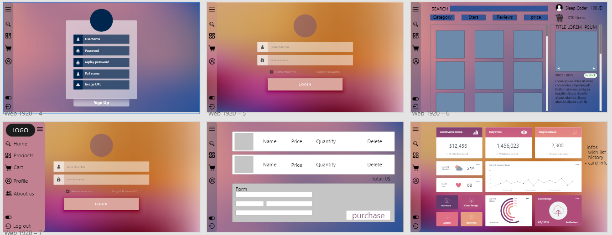
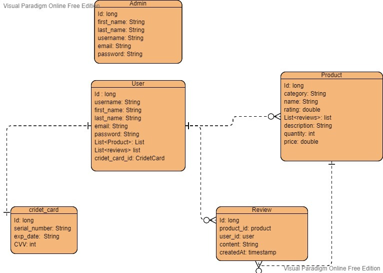

# **Valhalla-tech - (401-midterm-project)**
## Project Name
### Valhalla-tech 
&nbsp;

## Team Members
• **Rahaf Al-Jazzazi**

• **Mohammad Alzoubi**

• **Osaid Alhomedy**

• **Tariq Hasan Zeadeh**

• **Doaa Daban**

• **Hatem Sallam**

• **Anas Dlalah**

&nbsp;

## Description
In this web application there are four pages store, profile, cart, about us:
- When you successfully register you will go to the profile page and u will find your basic info, your card info and your wishlist contais the products you added and your history contains the products you've been bought before.
- In store page you will find list of products, you can filter the products depending on your needs, your budget, rating and reviews of that product.
 You can also check the details on that product on right side of the page and you can add it to cart or add it to your wish list.
- In cart page you can realized from the products that you've been choosed and choose the quantity and finally you can press checkout to fill your card information and confirm the purchase.
- At the last page you will find a brief of Valhalla Tech web applicatopn and the team members information.
Usage
First create an account by clicking on the signup button
then go to your profile page and there will be a your profile info and you can edit your info card there and update your wishlist and checkout your history.
You can edit your info of your profile by click edit card info button and fill the form.
If you want to buy any product you can choose the product from store page,add it to cart, see the reviwes, rating, and also add review of that product.
when you add the product to your cart you can go to the cart page and check out your products and increment or decrement the quantity or delete that product and when you press on checkout button you fill the form of your card information.
Admin user
As an admin can add any new product to our store page.

&nbsp;

## Problem Domain
Make the online shopping process as easy as possible with many features all in one single page application. 

&nbsp;

## Cooperation Plan
- All team members have variety of abilities and skills, but these are the key strengths for each (Enthusiasm, Creativity, Patience ,Teamwork).

- A team member who is good at "communicating" is always helpful in connecting the dots to a final result with the help of a" detail oriented " member to help him/her to connect the dots correctly. As every team member is unique in one strength but all members should know and understand the full aspects of the project in which case a daily meeting with all the team members should be held to follow up and check on the progress of the project.

&nbsp;

## Conflict Plan
As a team we have agreed on our main working hours as it will be the lab time during the lecture time and we made another working schedule to continue our work after the lap time, we will have 10 min break every hour, and 1 hour for lunch break.

Our day off will be on Friday to have a good rest and study more. As we will use (ZOOM & Discord) during the lab time and (Slack) too, as communication tools to ensure that everyone will share their thoughts.

&nbsp;

## Challenges
- Being linked to a specific time in order to finish all the work.
- Connecting to the database.
- Conflict and errors.
- Utilizing the functionalities especially in these matters:
    - Spring security.
    - Connecting front End with Back End.

&nbsp;

## Work Plan
### [Trello work plan](https://trello.com/b/Gnls837b/401-mid-project-management)
&nbsp;

## Git Process
We will create an organizations in Github and create the project repository and shared it on GitHub as well as clone it on our individual devices to start the work, each one of us will use a branch to work on it, we will push our work on the development branch at the end of each day.(Merge Party)

&nbsp;

## Wire-Frame 

&nbsp;

## Database Schema Diagram

&nbsp;

## Resources 

- [Spring Boot + React: JWT Authentication & Authorization with Spring Security](https://www.youtube.com/watch?v=CsgtYvlR7xk&t=1s)

- StackOverFlow
- Bootstrap, react , MDN.
- spring boot, Baeldung
- GEEKSFORGEEKS
- Poweupcloud
